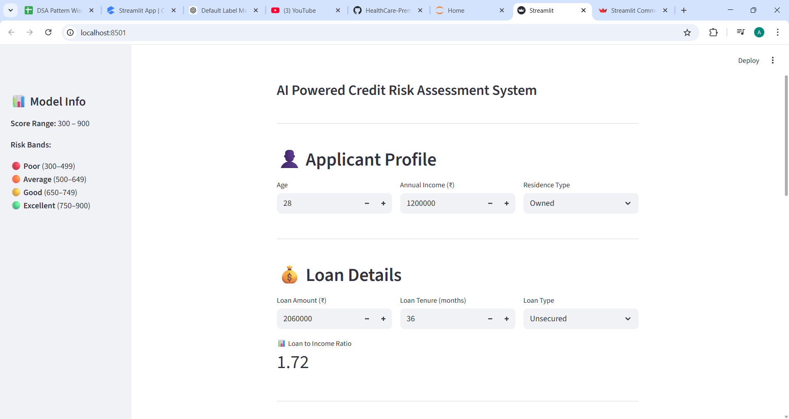
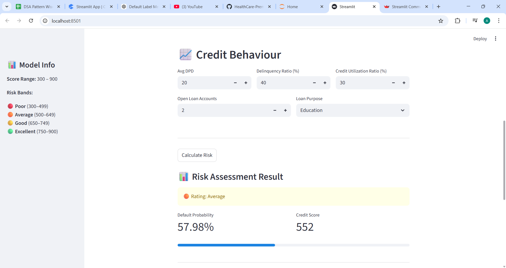
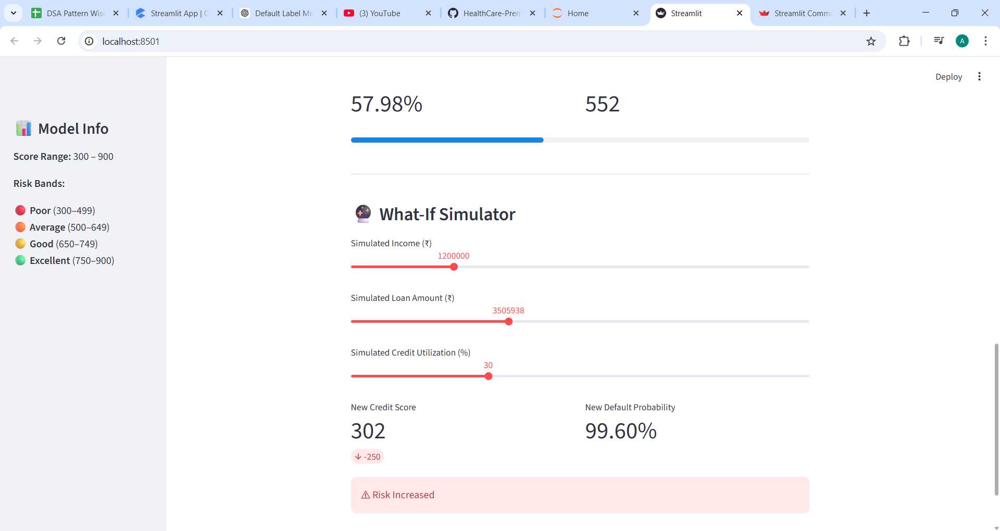
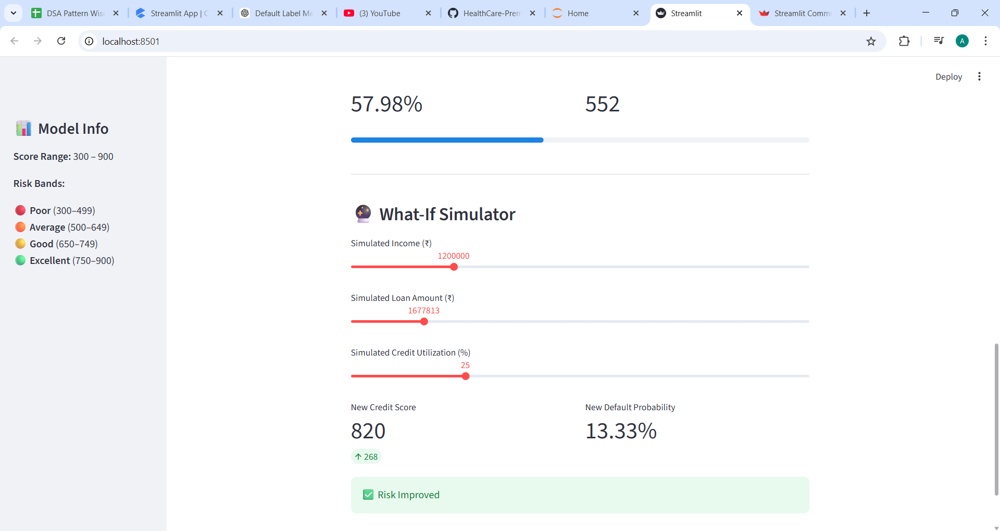

# 🏦 Lauki Finance – Credit Risk Modelling App

[🚀 Live Demo](https://your-live-demo-link.streamlit.app)  
[💼 LinkedIn](https://www.linkedin.com/in/aditi-patil31/)  
[📂 GitHub Repository](https://github.com/your-username/credit-risk-app)

---

## 📌 Project Overview

Lauki Finance is an AI-powered **Credit Risk Assessment System** built using Machine Learning and deployed with Streamlit.

The application predicts:

- ✅ Probability of Default  
- ✅ Credit Score (300 – 900 scale)  
- ✅ Risk Rating (Poor / Average / Good / Excellent)  
- ✅ Scenario Impact using an interactive What-If Simulator  

This project simulates how fintech companies evaluate loan applicants in real-world lending systems.

---

## 🎯 Key Features

### 👤 Applicant Profile Dashboard
- Personal details input
- Loan details
- Credit behaviour metrics
- Automatic Loan-to-Income ratio calculation

### 📊 Risk Assessment Engine
- Logistic Regression model
- Default probability prediction
- Credit score transformation (300–900 scale)
- Risk band classification
- Visual risk display

### 🔮 What-If Simulator
- Adjust:
  - Income
  - Loan Amount
  - Credit Utilization
- Instantly observe:
  - Score changes
  - Probability shift
  - Risk band movement

---

## 🧠 Risk Bands

| Rating       | Score Range |
|--------------|------------|
| 🔴 Poor       | 300 – 499 |
| 🟠 Average    | 500 – 649 |
| 🟡 Good       | 650 – 749 |
| 🟢 Excellent  | 750 – 900 |

---

## 🛠️ Tech Stack

- Python  
- Pandas  
- NumPy  
- Scikit-learn  
- Streamlit  
- Joblib  

---

## 📈 Model Details

- **Algorithm Used:** Logistic Regression  
- **Problem Type:** Binary Classification (Default vs Non-Default)  
- **Output:**  
  - Probability of Default  
  - Credit Score scaled to 300–900  
  - Risk Rating (Poor / Average / Good / Excellent)

### Feature Engineering:
- Loan-to-Income Ratio calculation  
- One-Hot Encoding for categorical variables  
- Feature scaling for numerical stability  

The probability output from Logistic Regression is transformed into a credit score between **300 and 900**, simulating a real-world credit scoring system.

---

## 🏆 What This Project Demonstrates

This project showcases:

- End-to-end Machine Learning pipeline  
- Data preprocessing and feature engineering  
- Model training and serialization (Joblib)  
- Real-time prediction system  
- Credit score transformation logic  
- Interactive financial dashboard using Streamlit  
- What-If risk simulation for scenario analysis  
- Clean UI design with session state management  

It simulates how fintech companies assess credit risk in real-world lending environments.

---

## ⚙️ How to Run the Project Locally

### 1️⃣ Clone the Repository

```bash
git clone https://github.com/AditiPatil31/Credit-Risk-Modelling.git
cd Credit-Risk-Modelling
pip install -r requirements.txt
streamlit run main.py

---

## 📸 Application Preview

<p align="center">
  
  
</p>

<p align="center">
  
  
</p>

⭐ If you like this project, consider giving it a star!
